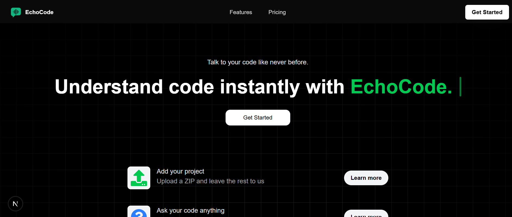
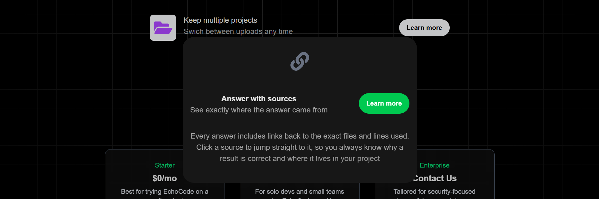
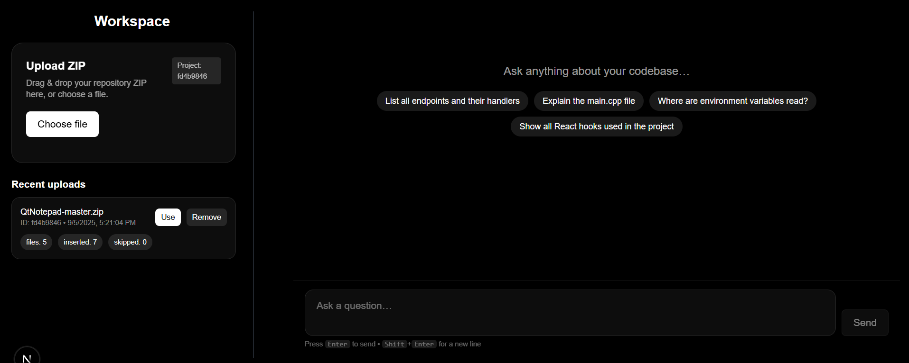
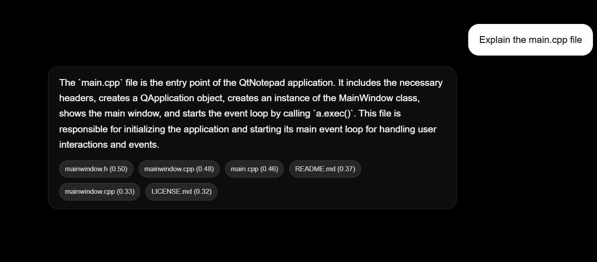

# EchoCode — Talk to Your Codebase

> Upload your codebase as a ZIP file and ask questions in plain English—EchoCode indexes your project with embeddings stored in **your** Supabase instance, then answers with clear, source-linked replies. Built with **Next.js 15, TypeScript, Tailwind CSS, Framer Motion, Supabase (pgvector),** and **OpenAI**.


---

## Table of Contents

- [Overview](#overview)
- [Screenshots](#screenshots)
- [Features](#features)
- [Tech Stack](#tech-stack)
- [System Architecture](#system-architecture)
- [Getting Started](#getting-started)
- [Core Flows](#core-flows)
- [API Reference](#api-reference)
- [Accessibility & Performance](#accessibility--performance)
- [Testing](#testing)
- [Security Notes](#security-notes)

---

## Overview

**EchoCode** (also known as *TalkToCode*) lets you upload a ZIP of your project and interact with it:  
Ask questions like “What does `navbar.jsx` do?” or “Where do we validate login?”  
EchoCode extracts and embeds your files, stores embeddings as vectors in Supabase, and uses a lightweight RAG pipeline to deliver fast, readable, source-linked answers. The UI is responsive, minimal, and keyboard-friendly.

---

## Screenshots









---

## Features

- 📦 **Upload & Index:** Drag-and-drop ZIP file; chunk and embed files into `pgvector`.
- 💬 **Ask Anything:** Natural language Q&A over your codebase.
- 🔗 **Citations:** Clickable sources back to files/lines.
- ⚡ **Streaming Replies:** Markdown answers, code highlighting, fast response.
- 🗂️ **Multiple Projects:** Switch between uploads; recent history.
- 🧩 **Clean UI:** Hero/Features/Pricing landing; modern workspace.

---

## Tech Stack

- **Frontend:** Next.js 15 (App Router), React 18, TypeScript, Tailwind CSS, Framer Motion, Tabler Icons
- **Backend:** Next.js Route Handlers (`/app/api/*`)
- **Data:** Supabase Postgres + **pgvector** (`vector(1536)`)
- **AI:** OpenAI Embeddings (`text-embedding-3-small`), Chat (`gpt-3.5-turbo` default)

---

## System Architecture

- **Client (Next.js app):**  
  Renders pages/components, triggers uploads, asks questions.

- **API Routes:**  
  - `/api/upload` — accepts ZIP, unzips to `/uploaded`
  - `/api/embed` — reads files, chunks & embeds using OpenAI, stores to Supabase
  - `/api/ask` — embeds questions, does ANN search in Supabase, streams answer

- **Supabase:**  
  - Postgres + `pgvector` for document/project storage
  - RPC for semantic search

- **App Structure:**  
  - UI: `Navbar`, `Hero`, `Features`, `Pricing`, `Workspace`
  - Workspace: `FileUpload`, `ChatPanel` (Enter to send, Shift+Enter for newline), `Sidebar`
  - Custom Hooks: `useOutsideClick` for modals/overlays

---

## Getting Started

### 1) Prerequisites

- Node.js 18+
- pnpm / npm / yarn
- Supabase project with **pgvector** enabled
- OpenAI API key

### 2) Install Dependencies

```bash
pnpm install
# or npm install / yarn
```

### 3) Environment Setup

- Create a `.env.local` file in your project root.
- Add the following keys to `.env.local`:

  ```env
  OPENAI_API_KEY=sk-...
  SUPABASE_URL=https://YOUR_PROJECT_REF.supabase.co
  SUPABASE_ANON_KEY=YOUR_ANON_KEY
  ```

---

## Core Flows

### 1) Upload → Embed
- User uploads a ZIP file in Workspace
- `/api/upload` unzips contents
- `/api/embed` walks files, chunks text, generates embeddings, upserts into Supabase

### 2) Ask a Question
- `/api/ask` embeds the question
- ANN search finds most relevant chunks in Supabase
- Sends context to OpenAI Chat model
- Streams Markdown answer with citations to UI

### 3) Multiple Projects
- Each session/project scoped with `project_id` in local storage
- Switch & maintain uploads, Q&A per project

---

## API Reference

_All routes live in `/app/api`, JSON unless specified._

### `POST /api/upload`
- Accepts ZIP file
- Unzips contents under `/uploaded`

### `POST /api/embed`
- Chunks, embeds, and upserts code into Supabase
- Reads files, creates embeddings, upserts rows under project

### `POST /api/ask`
- Embeds question and streams Markdown answer with citations
- Uses OpenAI + Supabase ANN search

---

## Accessibility & Performance

- Semantic HTML for workspace components
- Keyboard navigation: Enter/Shift+Enter, visible focus ring
- Semantic buttons for actions (Upload, Send, etc.)
- Fully responsive layout for desktop/mobile
- Animations respect "prefers-reduced-motion"
- Streaming answers for fast feedback

---

## Testing

- **API:** Smoke tests (basic GET/POST, optional)

---

## Security Notes

- All embeddings and projects reside in your Supabase; EchoCode never stores/extracts code externally
- Protect API keys and credentials—store only in environment variables
- Validate and sanitize file uploads, limit file sizes/types
